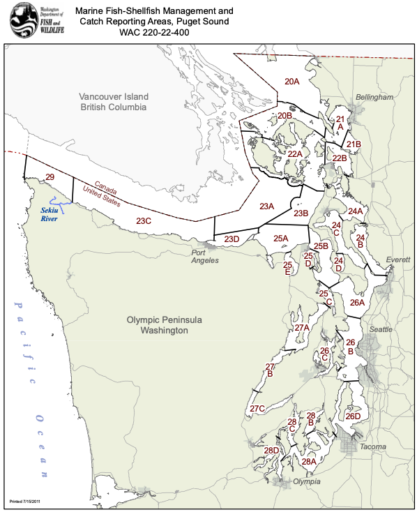
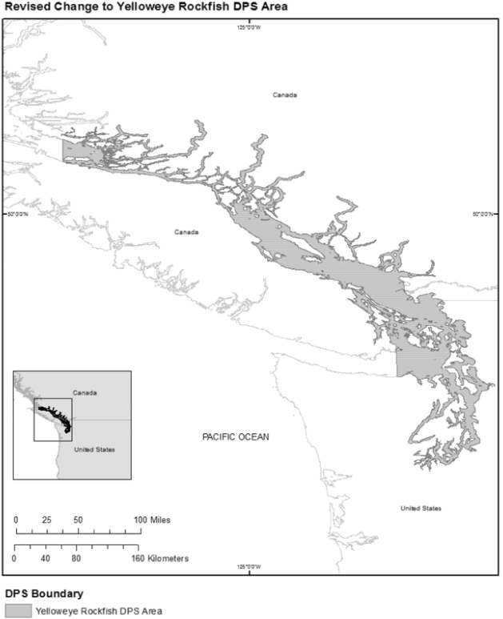
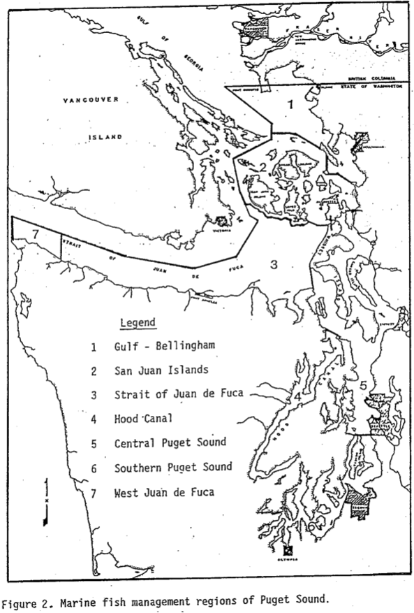

```{r load_libraries, message = FALSE, echo = FALSE, warning = FALSE}
library(tidyverse)
library(readxl)
library(here)
library(ggthemes)
library(ggpubr)
library(janitor)

fig_dir <- here("figures", "catch_reconstruction")
```

## Introduction

-   Catch reconstruction for Yelloweye Rockfish (*S. ruberrimus*) and Bocaccio (*S. paucispinis*) in Puget Sound
-   Missing data for years with known non-zero catches interpolated
-   Yelloweye rockfish broken down into Hood Canal and non-Hood Canal (in accordance with Rockfish Recovery Plan)
-   Attempt to capture uncertainty with "high", "medium", and "low" catch scenarios
    + "Medium" scenario is our "best guess"; "high" and "low" aim to capture the upper and lower bounds

## Outline

-   Commercial data

    1)  2004-2020
    2)  1970-2003
    3)  1955-1969
    4)  1935-1954
    5)  1921-1933

-   Recreational data

    1)  2003-2019
    2)  1994-2002
    3)  1970-1993
    4)  Pre-1970

## Commercial Data: 2004-2020 | Overview
- Low amounts of commercial catch in Puget Sound, following a number of significant regulation changes to the commercial fishery
- Species composition data from WDFW samplers
- Landings data from the Fish Ticket Landing System (LiFT); contains information on date, area of capture, gear, species, and weight
- Yelloweye rockfish are recorded at the species level, bocaccio are grouped together with 12 other species in the “shelf rockfish” category

## Commercial Data: 2004-2020 | Catch Scenarios
<div style="float: left; width: 50%;">
{width=100%}
</div>

<div style="float: right; width: 50%; font-size: 16pt;">
- Yelloweye:
    - Hood Canal: Areas 27A, 27B, and 27C
    - Non-Hood Canal: Everything excluding areas 29, 23C, and Hood Canal
    - All catch scenarios are the same for this time period

- Bocaccio:
    - High catch: All "shelf rockfish" are bocaccio.
    - Medium catch: 50% of "shelf rockfish" are bocaccio.
    - Low catch: No "shelf rockfish" are bocaccio.
</div>

## Commercial Data: 1970-2003 | Overview
- Characterized by concerted efforts by WDFW to better estimate species compositions of landings; coincides with increased effort targeting bottomfish in Puget Sound
- This is also the period that is the focus of Wayne Palsson’s 2009 paper and thus there is a relatively high degree of confidence in these values (at least the total rockfish landings)
- Species composition data published in multiple reports covering 1970-1987 (Schmitt et al. 1991), 1988, 1989, 1990, 1991, and 1993
- Data provided by Wayne Palsson; catch already prorated to species level based on species composition data

## Commercial Data: 1970-2003 | Reporting Areas
<div style="float: left; width: 45%;">
{width=100%}
</div>

<div style="float: right; width: 55%; font-size: 12pt">
{width=65%}


Commercial catch reporting areas for this time period; note how region 3 is only partially in the DPS
</div>

## Commercial Data: 1970-2003 | Catch Scenarios

- Yelloweye and Bocaccio:
    - High catch: All catch from the Strait of Juan de Fuca is included.
    - Medium catch: 50% of the catch from the Strait of Juan de Fuca is included.
    - Low catch: No catch from the Strait of Juan de Fuca is included.
    
## Commercial Data: 1955-1969 | Overview

- Data from Yellow Book (Green Book); origins are a bit fuzzy but it's generally accepted that this is the best source of commercial data statistics for this time period
- Market categories listed for this time period: "general rockfish", "red snapper", and "black rockfish"
    - Yelloweye catches for this time period are taken to be the "red snapper" category; unknown what proportion of this catch is actually yelloweye vs. other species (e.g. vermilion and canary), and if there are some yelloweye in the "general rockfish" category
- Bocaccio catch estimated by prorating the "general rockfish" category by gear and region based on the the 1970-1987 species composition estimates from Schmitt et al. 1991

## Commercial Data: 1955-1969 | Catch Scenarios

- Yelloweye:
    - High catch: All "red snapper" catch from the Strait of Juan de Fuca is included.
    - Medium catch: 50% of the "red snapper" catch from the Strait of Juan de Fuca is included.
    - Low catch: No "red snapper" catch from the Strait of Juan de Fuca is included.
- Note: For the time period 1955-1969, no effort is recorded for gear types that caught Bocaccio in the Strait of Juan de Fuca and thus the catch of Bocaccio will not be affected by how much of the Strait of Juan de Fuca catch is included in the catch estimates.

## Commercial Data: 1935-1954 | Overview

- The Yellow Book data does not have any region-specific information for this time period, but there are catches by gear type
    - Yellow Book also does not have any catch data from 1933-1942
- The Bound Volumes do have region-specific information, which is necessary to split Hood Canal from the rest of the catch
- Data used from this time period comes directly from the Bound Volumes
- Catch composition data used is from species composition from 1970-1987, by gear and by region


## Commercial Data 1935-1954 | Bound Volumes vs. Yellow Book

{width=100%}

## Commercial Data 1935-1954 | Catch Scenarios

- Yelloweye and Bocaccio:
    - High catch: All catch from the Strait of Juan de Fuca is included.
    - Medium catch: 50% of the catch from the Strait of Juan de Fuca is included.
    - Low catch: No catch from the Strait of Juan de Fuca is included.
    
## Commercial Data 1921-1933 | Overview
- Catches from the Yellow Book
- Catches by gear type but not by region
- Total rockfish catch prorated to species using 1970-1987 species compositions by gear type and region
- Effort by region estimated roughly from Bound Volume effort distribution by region for following time period

## Commercial Data 1921-1933 | Effort Estimates by Region

| Region | Percentage of Effort |
|-|-|
| Central Puget Sound | 35% |
| Gulf - Bellingham | 15% |
| Hood Canal | 5% |
| San Juan Islands | 10% |
| Southern Puget Sound | 30% |
| Strait of Juan de Fuca | 5% |

## Commercial Data 1921-1933 | Catch Scenarios

This time period has a huge amount of uncertainty, but also has low catches and thus the different catch scenarios are unlikely to make much of a difference to estimates of initial stock size.

- Yelloweye and Bocaccio:
    - High catch: Double the prorated catch (2x estimates).
    - Medium catch: The prorated catch (1x estimates).
    - Low catch: Half of the prorated catch (0.5x estimates).
    
## Commercial Data Combined | Catch Scenarios

