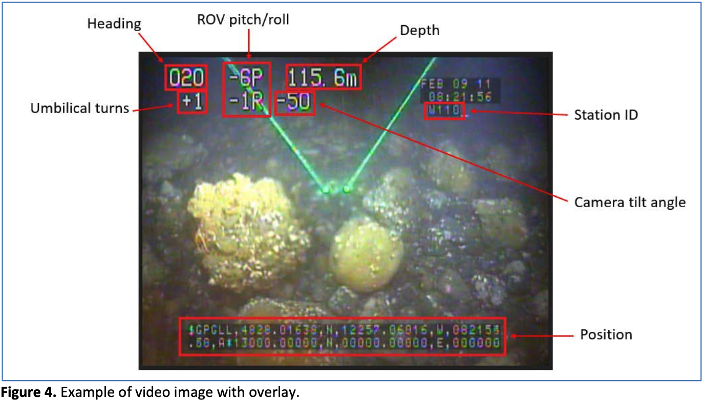
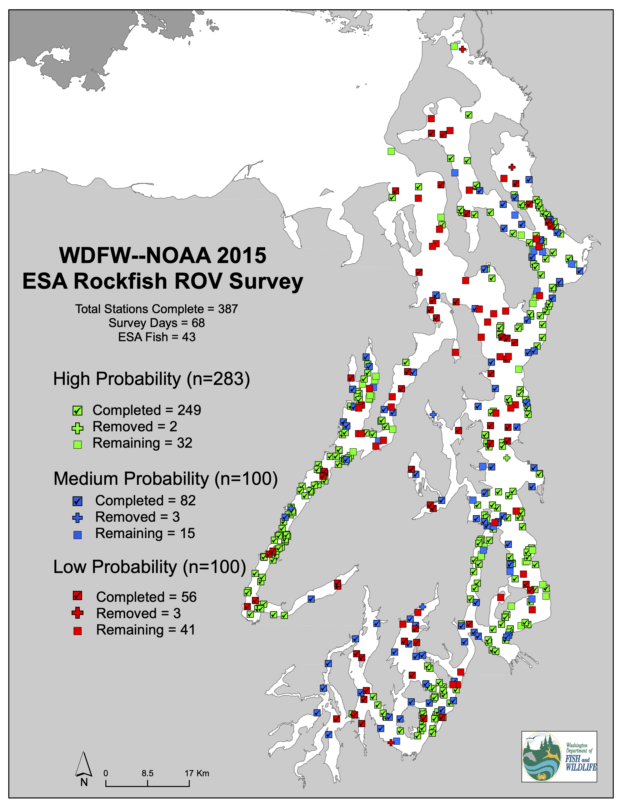
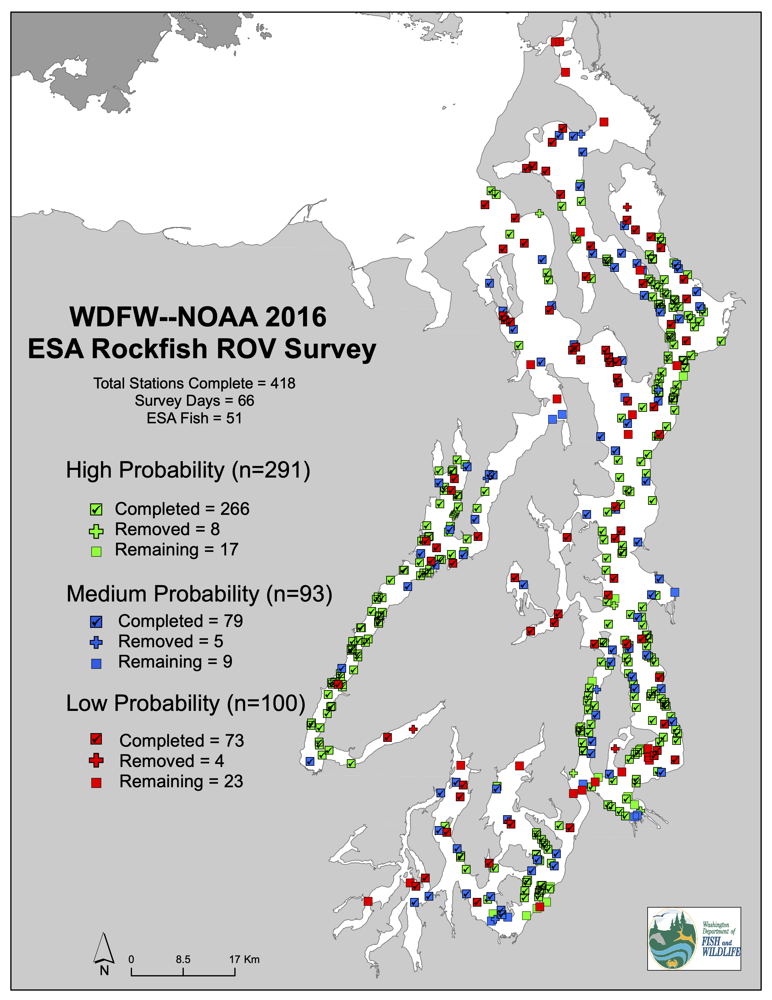
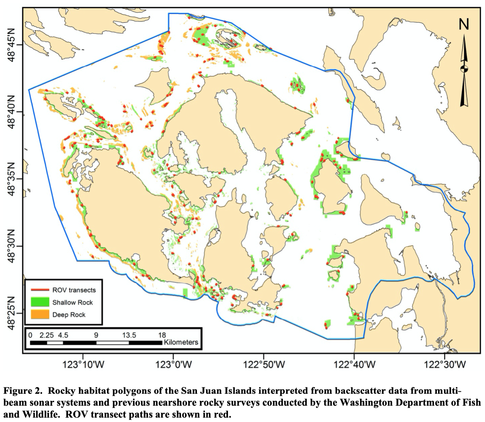
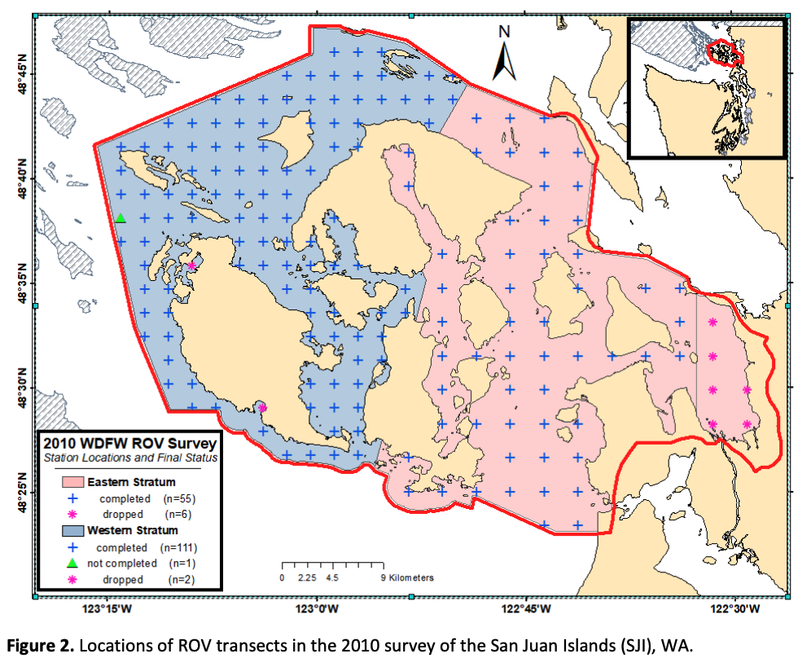
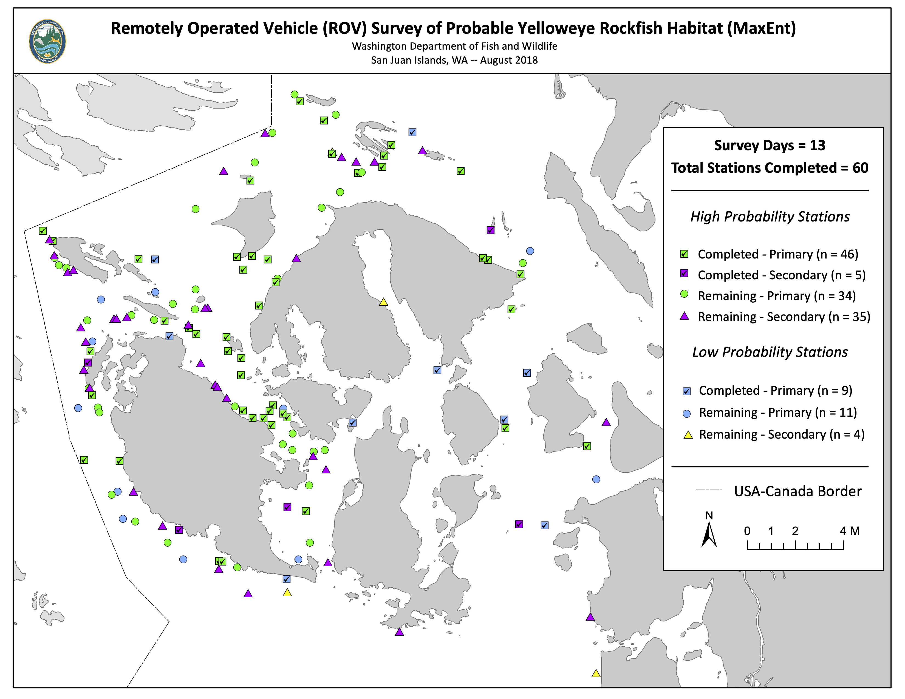
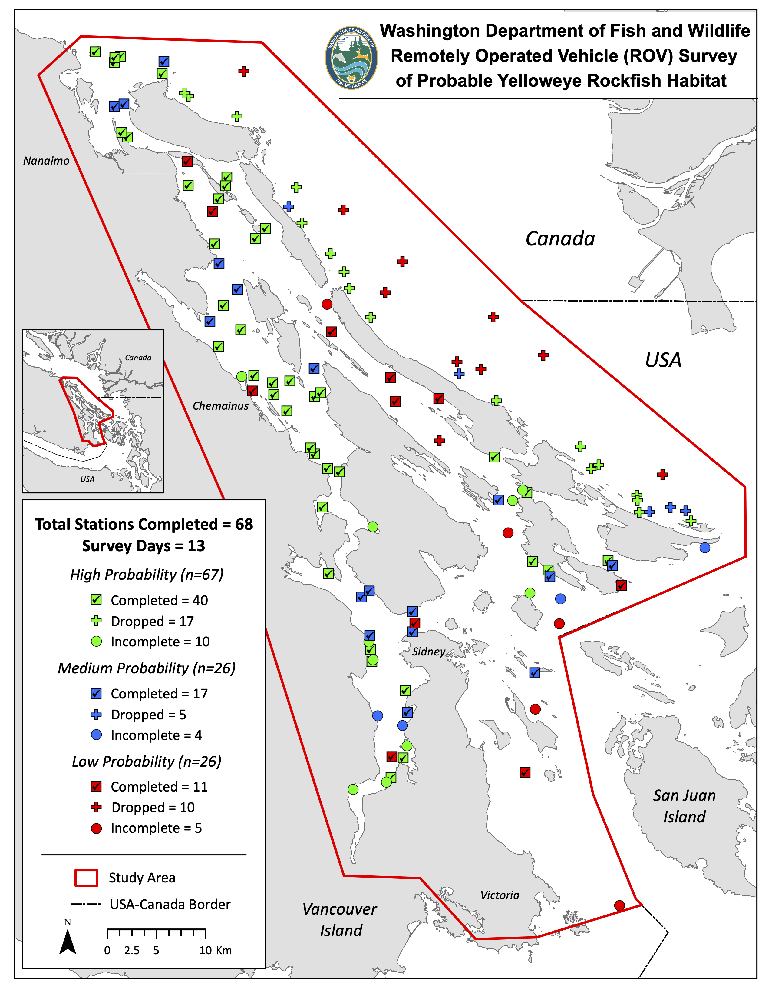
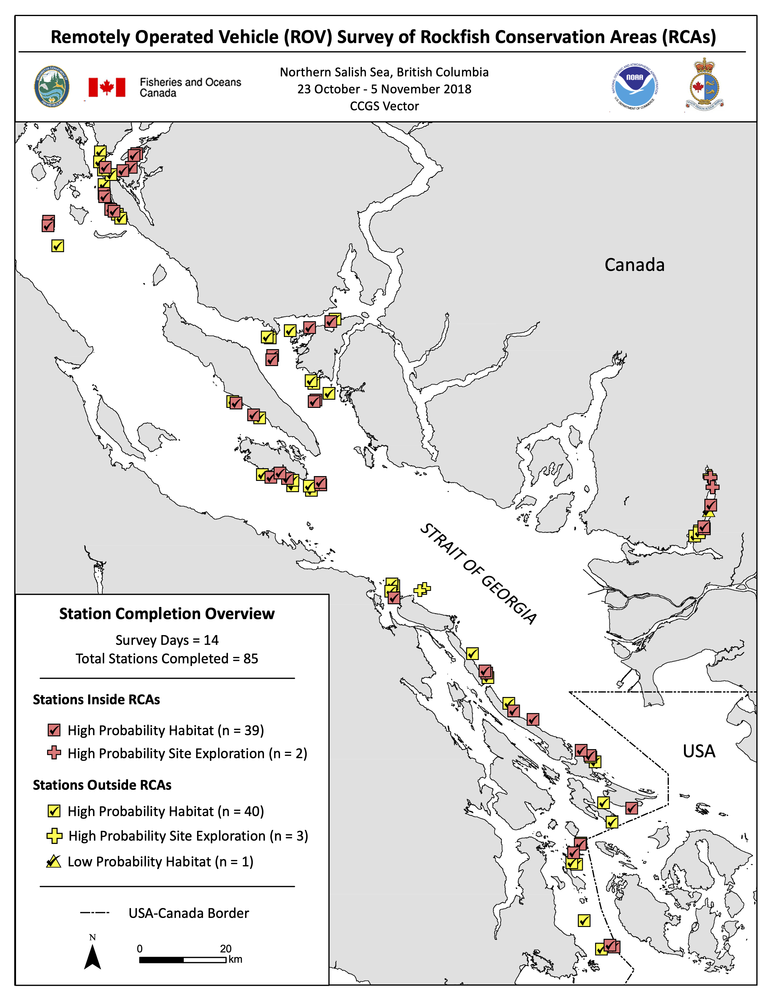

```{r setup, include=FALSE}
# Disable scientific notation
options(scipen=999)
```


```{r load_libraries, echo = FALSE, warning = FALSE, message = FALSE}
library(tidyverse)
library(readxl)
library(here)
library(ggthemes)
library(ggpubr)
library(janitor)
library(knitr)
library(kableExtra)

# Count number of medium/low stations in Hood Canal:
# 2015: 13 low, 12 medium
# 2016: 9 low, 12 medium
# 2015 totals: 82 medium, 56 low
# 2016 totals: 79 medium, 73 low
# 2015 and 2016, medium and low: 290 total medium and low
# 2015 and 2016, Hood Canal: 46 total medium and low
# 2015-16, non-Hood Canal: 244 total medium and low

# Load ROV data
ROV_results <- read.csv(here("outputs", "ROV_survey_abundance_estimates.csv"))
```


## ROV surveys
- 2008 San Juan Islands
- 2010 San Juan Islands
- 2015-16 Puget Sound
- 2018 San Juan Islands
- 2018 Vector Survey (Strait of Georgia)
- 2018 Gulf Islands Survey

## Uses of ROV data for 5-year review
- As an index of abundance for assessment model
    - Single time point of absolute abundance across entire DPS (as in the case of Hood Canal)
    - Time series of abundances from the same geographic area (as in the case of the San Juan Islands)
- As an index of abundance to compare with reference points from the assessment model
- To stress how repeated ROV surveys would allow us to track population dynamics without needing to do a formal assessment

## What is the selectivity of ROV surveys? | Key to contextualizing abundance estimates
- What types of individuals are seen by the ROV?
- What proportion of these individuals are seen by the ROV?

{width=80%}

## Calculating abundance
The mean stratum density ($\overline{D_s}$) for a given taxon was the the sum of the individual transect densities divided by the number of transects ($N_s$): 
  
$$
\overline{D_s} = \frac{\sum\limits_{i=1}^N D_i} {N_s}
$$
Total abundance ($P$) in numbers of individuals was the product of the stratum surface area ($SA_s$) and the mean taxon density ($\overline{D_s}$), with variance calculated as the product of the square of the surface area and the variance of mean stratum density: 
  
$$
P_s = SA_s\overline{D_s};Var(P_s) = SA_s^2Var(\overline{D_s})
$$


## Maximum entropy models
<div style="font-size: 16pt;">
- Machine learning method used to predict habitat suitability for target species
- Maximum entropy used for 2015-16 Puget Sound, 2018 SJI, 2018 Gulf Islands, and 2018 Vector Surveys
- Habitat suitability determined based on combination of previous occurrences and habitat characteristics/variables
    - Previous occurrences: Yelloweye and canary for 2015-16 Puget Sound Survey, only Yelloweye for other surveys
    - Habitat variables: Depth, roughness, and bottom current speed
- Output from maximum entropy model: probability distribution (PD) map for each species, where each cell is assigned a probability of suitable habitat (not fish presence) based on the retained input variables.
    - Different strata determined by ranges of probabilities
- 2018 Vector Survey (Strait of Georgia) included different habitat variables (?)
</div>
        
## 2015-16 Puget Sound Survey
<div style="float: left; width: 50%;">
{width=100%}
</div>

<div style="float: right; width: 50%;">
{width=100%}

</div>

## 2015-16 Puget Sound
```{r calculate_basin_areas, echo = FALSE, message = FALSE, warning = FALSE}
# Load areas (these are from Bob and are in hectares)
neah_bay_ha <- 30627
west_JDF_ha <- 99400
east_JDF_ha <- 168330
gulf_bellingham_ha <- 143615
SJI_ha <- 147623
whidbey_basin_ha <- 124854
central_PS_ha <- 222800
south_PS_ha <- 130466
HC_ha <- 125123

basin_areas <- data.frame(basin = c("neah_bay", "west_JDF", "east_JDF", "gulf_bellingham", "SJI", "whidbey_basin", "central_PS", "south_PS", "HC"), area = c(neah_bay_ha, west_JDF_ha, east_JDF_ha, gulf_bellingham_ha, SJI_ha, whidbey_basin_ha, central_PS_ha, south_PS_ha, HC_ha))
```

<div style="float: left; width: 50%; font-size: 16pt;">
#### non-Hood Canal

- Survey strata: "High" (>50%), "Medium" (25-50%), "Low" (<25%)
    - High stratum
        - 363 transects
        - 9,288 hectares
        - 25 yelloweye
    - Medium + Low strata
        - 244 transects
        - `r format(sum(subset(basin_areas, basin != "HC")$area)-9288,big.mark=",")` hectares
        - 0 yelloweye

- Population estimate: `r format(subset(ROV_results, area == "Puget Sound Proper (excluding Hood Canal)")$abundance, big.mark=",", digits = 0)` (CV = `r round(subset(ROV_results, area == "Puget Sound Proper (excluding Hood Canal)")$CV, 1)`%)
</div>

<div style="float: right; width: 50%; font-size: 16pt;">
#### Hood Canal
- Survey strata: "High" (>50%), "Medium" (25-50%), "Low" (<25%)
    - High stratum
        - 152 transects
        - 4,486 hectares
        - 37 yelloweye
    - Medium + Low strata
        - 46 transects
        - `r format(sum(subset(basin_areas, basin == "HC")$area)-4486, big.mark = ",")` hectares
        - 0 yelloweye
        
- Population estimate: `r format(subset(ROV_results, area == "Hood Canal")$abundance, big.mark=",", digits = 0)` (CV = `r round(subset(ROV_results, area == "Hood Canal")$CV, 1)`%)
</div>


## 2008 SJI ROV survey
<div style="float: left; width: 50%;">
{width=100%}
</div>

<div style="float: right; width: 50%; font-size: 16pt;">
- Rocky habitat identified using MBES (multibeam echosounder)
- Survey strata: “Shallow rock” and “Deep rock”
    - Shallow rock
        - 136 transects
        - 7,860 hectares
        - 1 yelloweye
    - Deep rock
        - 71 transects
        - 4,150 hectares
        - 38 yelloweye
- Population estimate: 47,407 (CV = 24.8%)

</div>

## 2010 SJI ROV survey
<div style="float: left; width: 50%;">
{width=100%}
</div>

<div style="float: right; width: 50%; font-size: 16pt;">
- Systematic grid used to determine transect locations; higher density of transects in Western SJI because of previous observations
- Survey strata: “Eastern SJI” and "Western SJI"
    - Eastern SJI
        - 55 transects
        - 50,850 hectares
        - 0 yelloweye
    - Western SJI
        - 111 transects
        - 53,164 hectares
        - 16 yelloweye
- Population estimate: 114,494 (CV = 44.0%)

</div>


## 2018 SJI ROV survey
<div style="float: left; width: 50%;">
{width=100%}


</div>

<div style="float: right; width: 50%; font-size: 16pt;">
- Maximum entropy model
- Survey strata: “High” (>25%) and "Low" (<25%)
    - High stratum
        - 51 transects
        - 6,036 hectares
        - 14 yelloweye
    - Low stratum
        - 9 transects
        - 102,115 hectares
        - 0 yelloweye
- Population estimate: `r format(subset(ROV_results, survey == "2018 San Juan Islands")$abundance, big.mark=",", digits = 0)` (CV = `r round(subset(ROV_results, survey == "2018 San Juan Islands")$CV, 1)`%)

</div>


## 2018 Gulf Islands survey
<div style="float: left; width: 50%;">
{width=100%}


</div>

<div style="float: right; width: 50%; font-size: 13pt;">
- Maximum entropy model
- Survey strata: "High" (>50%), "Medium" (25-50%), "Low" (<25%)
    - High stratum
        - 40 transects
        - 6,070 hectares
        - 49 yelloweye
    - Medium stratum
        - 17 transects
        - 21,462 hectares
        - 4 yelloweye
    - Low stratum
        - 11 transects
        - 76,206 hectares
        - 0 yelloweye
- Population estimates: 
    - High stratum: `r format(subset(ROV_results, survey == "2018 Gulf Islands - High Stratum")$abundance, big.mark=",", digits = 0)` (CV = `r round(subset(ROV_results, survey == "2018 Gulf Islands - High Stratum")$CV, 1)`%)
    - Medium stratum: `r format(subset(ROV_results, survey == "2018 Gulf Islands - Medium Stratum")$abundance, big.mark=",", digits = 0)` (CV = `r round(subset(ROV_results, survey == "2018 Gulf Islands - Medium Stratum")$CV, 1)`%)

</div>

## 2018 Vector survey
<div style="float: left; width: 50%;">
{width=100%}


</div>

<div style="float: right; width: 50%; font-size: 16pt;">
- Maximum entropy model
- Survey strata: “High”, "Low"
    - High stratum
        - 84 transects
        - 92,031 hectares
        - 198 yelloweye
    - Low stratum
        - 1 transect
        - 816,993 hectares
        - 0 yelloweye
- Population estimate: `r format(subset(ROV_results, survey == "2018 Vector")$abundance, big.mark=",", digits = 0)` (CV = `r round(subset(ROV_results, survey == "2018 Vector")$CV, 1)`%)


</div>


## ROV abundance results
```{r ROV_abundance_results, echo = FALSE}
kable(dplyr::select(ROV_results, -species), digits = 0, format.args = list(big.mark= ",")) %>% 
  kable_styling(font_size = 12) %>%
  kable_material(c("striped", "hover"))
```
