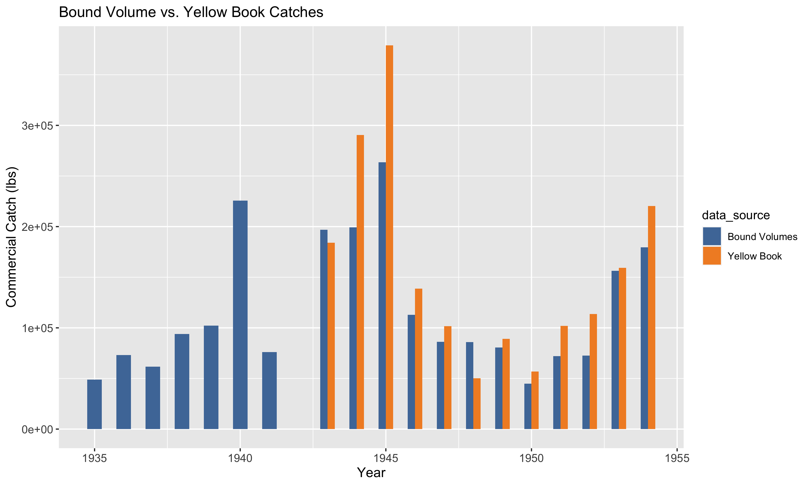
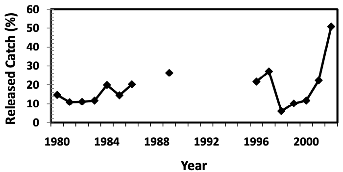
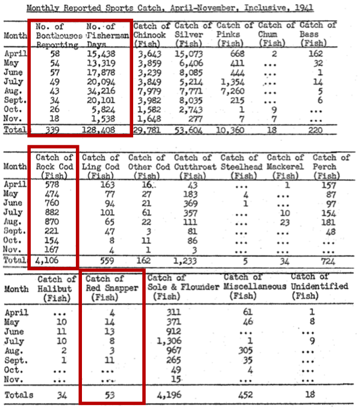
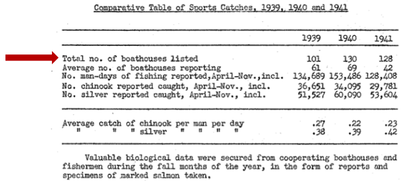
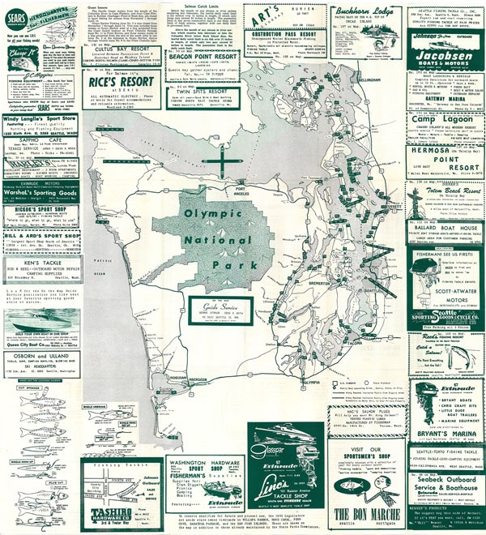

```{r load_libraries, message = FALSE, echo = FALSE, warning = FALSE}
library(tidyverse)
library(readxl)
library(here)
library(ggthemes)
library(ggpubr)
library(janitor)
library(knitr)
library(kableExtra)
library(zoo)

fig_dir <- here("figures", "catch_reconstruction")
```

```{r load_catch_reconstruction_data, message = FALSE, echo = FALSE, warning = FALSE}
# Load in data that are the outputs from catch_reconstruction_v2.Rmd

# Yelloweye high catch scenario, US DPS only
YE_high_catch_USDPS <- read.csv(here("catch_reconstruction_data", "complete_catch_histories", "yelloweye_USDPS_catch_scenario_high.csv"))

# Yelloweye medium catch scenario, US DPS only
YE_medium_catch_USDPS <- read.csv(here("catch_reconstruction_data", "complete_catch_histories", "yelloweye_USDPS_catch_scenario_medium.csv"))

# Yelloweye low catch scenario, US DPS only
YE_low_catch_USDPS <- read.csv(here("catch_reconstruction_data", "complete_catch_histories", "yelloweye_USDPS_catch_scenario_low.csv"))

# Yelloweye high catch scenario, Hood Canal
YE_high_catch_HC <- read.csv(here("catch_reconstruction_data", "complete_catch_histories", "yelloweye_HC_catch_scenario_high.csv"))

# Yelloweye medium catch scenario, Hood Canal
YE_medium_catch_HC <- read.csv(here("catch_reconstruction_data", "complete_catch_histories", "yelloweye_HC_catch_scenario_medium.csv"))

# Yelloweye low catch scenario, Hood Canal
YE_low_catch_HC <- read.csv(here("catch_reconstruction_data", "complete_catch_histories", "yelloweye_HC_catch_scenario_low.csv"))

# Yelloweye high catch scenario, US DPS + Canada (everything except Hood Canal)
YE_high_catch_CAN_USA <- read.csv(here("catch_reconstruction_data", "complete_catch_histories", "yelloweye_CAN_USA_catch_scenario_high.csv"))

# Yelloweye medium catch scenario, US DPS + Canada (everything except Hood Canal)
YE_medium_catch_CAN_USA <- read.csv(here("catch_reconstruction_data", "complete_catch_histories", "yelloweye_CAN_USA_catch_scenario_medium.csv"))

# Yelloweye low catch scenario, US DPS + Canada (everything except Hood Canal)
YE_low_catch_CAN_USA <- read.csv(here("catch_reconstruction_data", "complete_catch_histories", "yelloweye_CAN_USA_catch_scenario_low.csv"))

# Bocaccio high catch scenario, US DPS only
BOC_high_catch_USDPS <- read.csv(here("catch_reconstruction_data", "complete_catch_histories", "bocaccio_USDPS_catch_scenario_high.csv"))

# Bocaccio medium catch scenario, US DPS only
BOC_medium_catch_USDPS <- read.csv(here("catch_reconstruction_data", "complete_catch_histories", "bocaccio_USDPS_catch_scenario_medium.csv"))

# Bocaccio low catch scenario, US DPS only
BOC_low_catch_USDPS <- read.csv(here("catch_reconstruction_data", "complete_catch_histories", "bocaccio_USDPS_catch_scenario_low.csv"))

```

```{r reformat_comm_data, message = FALSE, echo = FALSE, warning = FALSE}
# Combine yelloweye commercial catches for non-HC
YE_high_catch_USDPS %>% 
    dplyr::rename(high = US_comm_catch_lbs) %>% 
    dplyr::select(year, high) -> YE_high_comm_catch_USDPS

YE_medium_catch_USDPS %>% 
    dplyr::rename(medium = US_comm_catch_lbs) %>% 
    dplyr::select(year, medium) -> YE_medium_comm_catch_USDPS

YE_low_catch_USDPS %>% 
    dplyr::rename(low = US_comm_catch_lbs) %>% 
    dplyr::select(year, low) -> YE_low_comm_catch_USDPS

YE_low_comm_catch_USDPS %>% 
    left_join(., YE_medium_comm_catch_USDPS, by = "year") %>% 
    left_join(., YE_high_comm_catch_USDPS, by = "year") -> YE_comm_catch_scenarios_USDPS

YE_comm_catch_scenarios_USDPS %>% 
    pivot_longer(., cols = c("low", "medium", "high"), names_to = "catch_scenario") -> YE_comm_catch_scenarios_USDPS

# Combine yelloweye commercial catches for HC
YE_high_catch_HC %>% 
    dplyr::rename(high = US_comm_catch_lbs) %>% 
    dplyr::select(year, high) -> YE_high_comm_catch_HC

YE_medium_catch_HC %>% 
    dplyr::rename(medium = US_comm_catch_lbs) %>% 
    dplyr::select(year, medium) -> YE_medium_comm_catch_HC

YE_low_catch_HC %>% 
    dplyr::rename(low = US_comm_catch_lbs) %>% 
    dplyr::select(year, low) -> YE_low_comm_catch_HC

YE_low_comm_catch_HC %>% 
    left_join(., YE_medium_comm_catch_HC, by = "year") %>% 
    left_join(., YE_high_comm_catch_HC, by = "year") -> YE_comm_catch_scenarios_HC

YE_comm_catch_scenarios_HC %>% 
    pivot_longer(., cols = c("low", "medium", "high"), names_to = "catch_scenario") -> YE_comm_catch_scenarios_HC


# Combine bocaccio commercial catches
BOC_high_catch_USDPS %>% 
    dplyr::rename(high = US_comm_catch_lbs) %>% 
    dplyr::select(year, high) -> BOC_high_comm_catch_USDPS

BOC_medium_catch_USDPS %>% 
    dplyr::rename(medium = US_comm_catch_lbs) %>% 
    dplyr::select(year, medium) -> BOC_medium_comm_catch_USDPS

BOC_low_catch_USDPS %>% 
    dplyr::rename(low = US_comm_catch_lbs) %>% 
    dplyr::select(year, low) -> BOC_low_comm_catch_USDPS

BOC_low_comm_catch_USDPS %>% 
    left_join(., BOC_medium_comm_catch_USDPS, by = "year") %>% 
    left_join(., BOC_high_comm_catch_USDPS, by = "year") -> BOC_comm_catch_scenarios_USDPS

BOC_comm_catch_scenarios_USDPS %>% 
    pivot_longer(., cols = c("low", "medium", "high"), names_to = "catch_scenario") -> BOC_comm_catch_scenarios_USDPS

```


```{r reformat_rec_data, message = FALSE, echo = FALSE, warning = FALSE}
# Combine yelloweye recercial catches for non-HC
YE_high_catch_USDPS %>% 
    dplyr::rename(high = US_rec_catch_lbs) %>% 
    dplyr::select(year, high) -> YE_high_rec_catch_USDPS

YE_medium_catch_USDPS %>% 
    dplyr::rename(medium = US_rec_catch_lbs) %>% 
    dplyr::select(year, medium) -> YE_medium_rec_catch_USDPS

YE_low_catch_USDPS %>% 
    dplyr::rename(low = US_rec_catch_lbs) %>% 
    dplyr::select(year, low) -> YE_low_rec_catch_USDPS

YE_low_rec_catch_USDPS %>% 
    left_join(., YE_medium_rec_catch_USDPS, by = "year") %>% 
    left_join(., YE_high_rec_catch_USDPS, by = "year") -> YE_rec_catch_scenarios_USDPS

YE_rec_catch_scenarios_USDPS %>% 
    pivot_longer(., cols = c("low", "medium", "high"), names_to = "catch_scenario") -> YE_rec_catch_scenarios_USDPS

# Combine yelloweye recercial catches for HC
YE_high_catch_HC %>% 
    dplyr::rename(high = US_rec_catch_lbs) %>% 
    dplyr::select(year, high) -> YE_high_rec_catch_HC

YE_medium_catch_HC %>% 
    dplyr::rename(medium = US_rec_catch_lbs) %>% 
    dplyr::select(year, medium) -> YE_medium_rec_catch_HC

YE_low_catch_HC %>% 
    dplyr::rename(low = US_rec_catch_lbs) %>% 
    dplyr::select(year, low) -> YE_low_rec_catch_HC

YE_low_rec_catch_HC %>% 
    left_join(., YE_medium_rec_catch_HC, by = "year") %>% 
    left_join(., YE_high_rec_catch_HC, by = "year") -> YE_rec_catch_scenarios_HC

YE_rec_catch_scenarios_HC %>% 
    pivot_longer(., cols = c("low", "medium", "high"), names_to = "catch_scenario") -> YE_rec_catch_scenarios_HC


# Combine bocaccio recercial catches
BOC_high_catch_USDPS %>% 
    dplyr::rename(high = US_rec_catch_lbs) %>% 
    dplyr::select(year, high) -> BOC_high_rec_catch_USDPS

BOC_medium_catch_USDPS %>% 
    dplyr::rename(medium = US_rec_catch_lbs) %>% 
    dplyr::select(year, medium) -> BOC_medium_rec_catch_USDPS

BOC_low_catch_USDPS %>% 
    dplyr::rename(low = US_rec_catch_lbs) %>% 
    dplyr::select(year, low) -> BOC_low_rec_catch_USDPS

BOC_low_rec_catch_USDPS %>% 
    left_join(., BOC_medium_rec_catch_USDPS, by = "year") %>% 
    left_join(., BOC_high_rec_catch_USDPS, by = "year") -> BOC_rec_catch_scenarios_USDPS

BOC_rec_catch_scenarios_USDPS %>% 
    pivot_longer(., cols = c("low", "medium", "high"), names_to = "catch_scenario") -> BOC_rec_catch_scenarios_USDPS

```


```{r reformat_total_catch_data, message = FALSE, echo = FALSE, warning = FALSE}
# Combine yelloweye total catches for non-HC
YE_high_catch_USDPS %>% 
    dplyr::rename(high = total_catch_lbs) %>% 
    dplyr::select(year, high) -> YE_high_total_catch_USDPS

YE_medium_catch_USDPS %>% 
    dplyr::rename(medium = total_catch_lbs) %>% 
    dplyr::select(year, medium) -> YE_medium_total_catch_USDPS

YE_low_catch_USDPS %>% 
    dplyr::rename(low = total_catch_lbs) %>% 
    dplyr::select(year, low) -> YE_low_total_catch_USDPS

YE_low_total_catch_USDPS %>% 
    left_join(., YE_medium_total_catch_USDPS, by = "year") %>% 
    left_join(., YE_high_total_catch_USDPS, by = "year") -> YE_total_catch_scenarios_USDPS

YE_total_catch_scenarios_USDPS %>% 
    pivot_longer(., cols = c("low", "medium", "high"), names_to = "catch_scenario") -> YE_total_catch_scenarios_USDPS

# Combine yelloweye total catches for HC
YE_high_catch_HC %>% 
    dplyr::rename(high = total_catch_lbs) %>% 
    dplyr::select(year, high) -> YE_high_total_catch_HC

YE_medium_catch_HC %>% 
    dplyr::rename(medium = total_catch_lbs) %>% 
    dplyr::select(year, medium) -> YE_medium_total_catch_HC

YE_low_catch_HC %>% 
    dplyr::rename(low = total_catch_lbs) %>% 
    dplyr::select(year, low) -> YE_low_total_catch_HC

YE_low_total_catch_HC %>% 
    left_join(., YE_medium_total_catch_HC, by = "year") %>% 
    left_join(., YE_high_total_catch_HC, by = "year") -> YE_total_catch_scenarios_HC

YE_total_catch_scenarios_HC %>% 
    pivot_longer(., cols = c("low", "medium", "high"), names_to = "catch_scenario") -> YE_total_catch_scenarios_HC


# Combine bocaccio total catches
BOC_high_catch_USDPS %>% 
    dplyr::rename(high = total_catch_lbs) %>% 
    dplyr::select(year, high) -> BOC_high_total_catch_USDPS

BOC_medium_catch_USDPS %>% 
    dplyr::rename(medium = total_catch_lbs) %>% 
    dplyr::select(year, medium) -> BOC_medium_total_catch_USDPS

BOC_low_catch_USDPS %>% 
    dplyr::rename(low = total_catch_lbs) %>% 
    dplyr::select(year, low) -> BOC_low_total_catch_USDPS

BOC_low_total_catch_USDPS %>% 
    left_join(., BOC_medium_total_catch_USDPS, by = "year") %>% 
    left_join(., BOC_high_total_catch_USDPS, by = "year") -> BOC_total_catch_scenarios_USDPS

BOC_total_catch_scenarios_USDPS %>% 
    pivot_longer(., cols = c("low", "medium", "high"), names_to = "catch_scenario") -> BOC_total_catch_scenarios_USDPS

```

## Introduction

-   Catch reconstruction for Yelloweye Rockfish (*S. ruberrimus*) and Bocaccio (*S. paucispinis*) in Puget Sound
-   Yelloweye rockfish broken down into Hood Canal and non-Hood Canal (in accordance with Rockfish Recovery Plan)
-   Our assessment model requires a complete time series of catches; any missing data is assumed to be zero (affects estimates of unfished biomass)
    + Missing data interpolated
-   Attempt to capture uncertainty with "high", "medium", and "low" catch scenarios
    + "Medium" scenario is our "best guess"; "high" and "low" aim to capture the upper and lower bounds

## Outline

-   Commercial data

    1)  2004-2020
    2)  1970-2003
    3)  1955-1969
    4)  1935-1954
    5)  1921-1933

-   Recreational data

    1)  2003-2019
    2)  1994-2002
    3)  1970-1993
    4)  Pre-1970


# Commercial Catch Reconstruction

## Commercial Data: 2004-2020 | Overview
<div style="font-size: 18pt;">
- Low amounts of commercial catch in Puget Sound, following a number of significant regulatory changes to the commercial fishery
- Species composition data from WDFW samplers
- Landings data from the Fish Ticket Landing System (LiFT); contains information on date, area of capture, gear, species, and weight
- Yelloweye rockfish are recorded at the species level, bocaccio are grouped together with 12 other species in the “shelf rockfish” category
- Bocaccio are very rare in Puget Sound catches
  - Greg Bargmann: "For what it is worth, during by 30+ years of dealing with Puget Sound commercial fisheries, I cannot recall ever seeing a single bocaccio in any catch I observed."
</div>

## Commercial Data: 2004-2020 | Catch Scenarios
<div style="float: left; width: 50%;">
{width=100%}
</div>

<div style="float: right; width: 50%; font-size: 16pt;">
- Yelloweye:
    - Hood Canal: Areas 27A, 27B, and 27C
    - Non-Hood Canal: Everything excluding areas 29, 23C, and Hood Canal
    - All catch scenarios are the same for this time period

- Bocaccio:
    - High catch: 5% of "shelf rockfish" are bocaccio.
    - Medium catch: No "shelf rockfish" are bocaccio.
    - Low catch: No "shelf rockfish" are bocaccio.
</div>

## Commercial Data: 1970-2003 | Overview
- Characterized by concerted efforts by WDFW to better estimate species compositions of landings; coincides with increased effort targeting bottomfish in Puget Sound
- This is also the period that is the focus of Wayne Palsson’s 2009 paper and thus there is a relatively high degree of confidence in these values (at least the total rockfish landings)
- Species composition data published in multiple reports covering 1970-1987 (Schmitt et al. 1991), 1988, 1989, 1990, 1991, and 1993
- Data provided by Wayne Palsson; catch already prorated to species level based on species composition data

## Commercial Data: 1970-2003 | Reporting Areas
<div style="float: left; width: 45%;">
{width=100%}
</div>

<div style="float: right; width: 55%; font-size: 12pt">
{width=65%}


Commercial catch reporting areas for this time period; note how region 3 is only partially in the DPS
</div>

## Commercial Data: 1970-2003 | Catch Scenarios

- Yelloweye (non-HC) and Bocaccio:
    - High catch: All catch from the Strait of Juan de Fuca is included.
    - Medium catch: 50% of the catch from the Strait of Juan de Fuca is included.
    - Low catch: No catch from the Strait of Juan de Fuca is included.
- Likely an underestimate of uncertainty (e.g. in catch compositions), but because of summarized format of data provided it is difficult to parse apart scenarios
    
## Commercial Data: 1955-1969 | Overview

- Data from Yellow Book (Green Book); origins are a bit fuzzy but it's generally accepted that this is the best source of commercial data statistics for this time period
- Market categories listed for this time period: "general rockfish", "red snapper", and "black rockfish"
    - Yelloweye catches for this time period are taken to be the "red snapper" category; unknown what proportion of this catch is actually yelloweye vs. other species (e.g. vermilion and canary), and if there are some yelloweye in the "general rockfish" category
- Bocaccio catch estimated by prorating the "general rockfish" category by gear and region based on the the 1970-1987 species composition estimates from Schmitt et al. 1991


## Commercial Data: 1955-1969 | Catch Scenarios

- Yelloweye (non-HC):
    - High catch: All "red snapper" catch from the Strait of Juan de Fuca is included.
    - Medium catch: 50% of the "red snapper" catch from the Strait of Juan de Fuca is included.
    - Low catch: No "red snapper" catch from the Strait of Juan de Fuca is included.
- Note: For the time period 1955-1969, no effort is recorded for gear types that caught Bocaccio in the Strait of Juan de Fuca and thus the catch of Bocaccio will not be affected by how much of the Strait of Juan de Fuca catch is included in the catch estimates.

## Commercial Data: 1935-1954 | Overview

- The Yellow Book data does not have any region-specific information for this time period, but there are catches by gear type
    - Yellow Book also does not have any catch data from 1933-1942
- The Bound Volumes do have region-specific information, (necessary to split Hood Canal from the rest of the catch)
- Bound Volumes data used for this time period
  + Note: Data from the Bound Volumes has never been formally QC'd; however, landings are comparable to Yellow Book values (see next slide)
- Catch composition data used is from species composition from 1970-1987, by gear and by region


## Commercial Data 1935-1954 | Bound Volumes vs. Yellow Book

{width=100%}

## Commercial Data 1935-1954 | Catch Scenarios

- Yelloweye and Bocaccio:
    - High catch: All catch from the Strait of Juan de Fuca is included.
    - Medium catch: 50% of the catch from the Strait of Juan de Fuca is included.
    - Low catch: No catch from the Strait of Juan de Fuca is included.
    
## Commercial Data 1921-1933 | Overview
- Catches from the Yellow Book
- Catches by gear type but not by region
- Total rockfish catch prorated to species using 1970-1987 species compositions by gear type and region
- Effort by region estimated roughly from Bound Volume effort distribution by region for following time period

## Commercial Data 1921-1933 | Effort Estimates by Region

| Region | Percentage of Effort |
|-|-|
| Central Puget Sound | 35% |
| Gulf - Bellingham | 15% |
| Hood Canal | 5% |
| San Juan Islands | 10% |
| Southern Puget Sound | 30% |
| Strait of Juan de Fuca | 5% |

## Commercial Data 1921-1933 | Catch Scenarios

This time period has a huge amount of uncertainty, but also has low catches and thus the different catch scenarios are unlikely to make much of a difference to estimates of initial stock size.

- Yelloweye and Bocaccio:
    - High catch: Double the prorated catch (2x estimates).
    - Medium catch: The prorated catch (1x estimates).
    - Low catch: Half of the prorated catch (0.5x estimates).
    
## Commercial Data | Yelloweye (non-HC) Catch Scenarios
```{r plot_YE_USDPS_comm_catch, echo = FALSE, message = FALSE}
YE_comm_catch_scenarios_USDPS$catch_scenario <- factor(YE_comm_catch_scenarios_USDPS$catch_scenario, levels = c("high", "medium", "low"))
ggplot(YE_comm_catch_scenarios_USDPS, aes(x = year, y = value, color = catch_scenario))+
    geom_line()+
    ylab("Catch (lbs)")+
    ggtitle("Yelloweye Commercial Catch (US waters excl. Hood Canal)")
```

## Commercial Data | Yelloweye (HC) Catch Scenarios
```{r plot_YE_HC_comm_catch, echo = FALSE, message = FALSE}
YE_comm_catch_scenarios_HC$catch_scenario <- factor(YE_comm_catch_scenarios_HC$catch_scenario, levels = c("high", "medium", "low"))
ggplot(YE_comm_catch_scenarios_HC, aes(x = year, y = value, color = catch_scenario))+
    geom_line()+
    ylab("Catch (lbs)")+
    ggtitle("Yelloweye Commercial Catch (Hood Canal only)")
```

## Commercial Data | Bocaccio Catch Scenarios
```{r plot_BOC_USDPS_comm_catch, echo = FALSE, message = FALSE}
BOC_comm_catch_scenarios_USDPS$catch_scenario <- factor(BOC_comm_catch_scenarios_USDPS$catch_scenario, levels = c("high", "medium", "low"))
ggplot(BOC_comm_catch_scenarios_USDPS, aes(x = year, y = value, color = catch_scenario))+
    geom_line()+
    ylab("Catch (lbs)")+
    ggtitle("Bocaccio Commercial Catch")
```

# Recreational Catch Reconstruction

## Recreational Data | Weight Conversions

- Recreational catches in numbers of fish and were be converted to weights for inclusion in model
- Same weight per individual used for each time period:
  - Yelloweye: 2.3 kg (5.07 lbs) mean weight; from Wildermuth 1983, based on mean weight (N = 124) from 1981, data collected by MRFSS samplers in "the marine waters of Washington"
  - Bocaccio: 4.08 kg (8.99 lbs) mean weight; source is "Old WDW19 program conversion" (value provided by Wayne Palsson)

## Recreational Data | Released Catch and Barotrauma
<div style="font-size: 16pt;">
- A remaining source of uncertainty, particularly for the older data, is mortality of yelloweye and bocaccio that were discarded/released. This was not addressed in this analysis for data from before 2003, which is when releases were first estimated through the creel survey
{width=70%}

Percent released catch to total catch of rockfishes reported by anglers interviewed during the Marine recreational Fisheries Statistical Survey. (Palsson et al. 2009)
</div>

## Recreational Data: 2003-2019 | Overview
- Estimates are from WDFW creel survey
    - Creel survey yields estimate and variance
- For rare species (like bocaccio and yelloweye), variance in estimates is very high
- Recreational catch is very low (retention of yelloweye banned in 2002, bocaccio are extremely rare)
- Statistics for both fish that were harvested and those that were released; how do we address the question of rockfish dying after release from barotrauma?
    - Hochhalter and Reed (2011) estimated almost 99% survival of yelloweye rockfish released at depth, but only about 22% of yelloweye rockfish released at the surface


## Recreational Data: 2003-2019 | Catch Scenarios

- Yelloweye and Bocaccio:
    - High catch: Creel estimate + one SD; 50% of estimated released rockfishes considered to be catch (died from barotrauma)
    - Medium catch: Creel estimate; 20% of estimated released rockfishes considered to be catch (died from barotrauma)
    - Low catch: Creel estimate - one SD; 5% of estimated released rockfishes considered to be catch (all released at depth, 95% survived - from Hannah et al. 2014, work done on yelloweye) 
    
## Recreational Data: 1970-2002 | Catch compositions
- Catch composition data for this time period comes from MRFSS
- MRFSS data: 1980-1986, 1989, 1996-2003
- Small sample sizes (total yelloweye = 126, total bocaccio = 22); therefore, combined all MRFSS data across this time period to get an estimate of the proportion of rockfish catch that are yelloweye and bocaccio
- Different catch compositions applied for each PCA

## Recreational Data: 1970-2002 | Data
- Data comes from the NFINREC file
- For 1970-1985, data is mostly prorated to species (I believe this is from Palsson 1987), with some catch still reported as "ROCKFISH-UNCLASSIFIED"; for 1986-2002, catch only reported as "TOTAL ROCKFISH"
  - 1970-1985: "ROCKFISH-UNCLASSIFIED" category prorated to species based on MRFSS catch compositions and added to estimates of yelloweye/bocaccio
  - 1986-2002: "TOTAL ROCKFISH" category prorated to species based on MRFSS catch compositions

## Recreational Data: 1994-2002 | Overview
"Beginning in 1994, large–scale closures occurred for the recreational salmon fishery, preventing successful bottomfish catch and effort estimates in many areas of Puget Sound. When an area is closed to recreational salmon fishing, there is no numerator to divide by then effort or bottomfish catch rate, preventing any point estimate of effort or bottomfish catch. Consequently, bottomfish catch and effort estimates have been severely underestimated from 1994 to 2003." (Palsson et al. 2009)


## Recreational Data: 1994-2002 | Catch Scenarios
We know that catch was underreported, but by how much? The estimates for this time period can be treated as a minimum estimate (the "low" scenario), but determining the other scenarios is more difficult. Data from the Strait of Juan de Fuca must also be dealt with.

- Yelloweye and Bocaccio:
    - High catch: All catch from the Strait of Juan de Fuca is included. Prorated estimate x 3.
    - Medium catch: 50% of the catch from the Strait of Juan de Fuca is included. Prorated estimate x 2.
    - Low catch: No catch from the Strait of Juan de Fuca is included.. Prorated estimate x 1.

## Recreational Data: 1970-1993 | Overview

- Data from Wayne Palsson's reports; comes from a combination of required catch records from salmon anglers and a dockside creel survey of hook-and-line anglers
    - Effort estimated by number of trips taken by salmon anglers (recreational fishery much better documented); this effort is then multiplied by estimates of bottomfish catch by anglers derived from the creel survey data
    
## Recreational Data: 1970-1993 | Catch Scenarios

- Yelloweye (non-HC) and Bocaccio:
  - High catch: All catch from the Strait of Juan de Fuca is included.
  - Medium catch: 50% of the catch from the Strait of Juan de Fuca is included.
  - Low catch: No catch from the Strait of Juan de Fuca is included.

## Recreational Data: 1965-1969 | Overview

- Tables from separate reports by Buckley, Sattherwhaite, and Bargmann.
- Catch compositions are from six technicians sampling the recreational salmon fishery, effort from the salmon fishery
- Noted that most bottomfish caught were discarded/released and thus not represented in these landings statistics:
    - “At present, the majority of Washington’s sport anglers consider most bottomfish as “scrap fish” and the ratio of the number retained in the harvest to the number actually caught appears extremely low in all areas.” (Buckley 1965)

## Recreational Data: 1965-1969 | Issues

- Buckley's report on the 1965 bottomfish fishery is particularly problematic, as there are some very anomalously high numbers of yelloweye caught.
  - Buckley: In 1965, 22.7% of rockfish caught in Hood Canal were yelloweye and 15.4% of rockfish caught in South Sound were yelloweye. These values are about an order of magnitude higher than other catch composition data
- Possible explanations include a large number of yelloweye observed in a small sample size of the recreational catch that was used for species composition data or incorrect species ID
- Buckley report for 1965 removed; reports for 1966 and 1967 kept.

## Recreational Data: Pre-1966 | Species Composition

- No species composition data are available for this time period, therefore must apply species composition data from other sources (i.e. Buckley reports 1965-1967 or MRFSS data 1980-2003) to estimate yelloweye and bocaccio catch
- Recreational catch estimates for 1943-1965 have the following catch scenarios:
  - High catch: Buckley (1965-1967) catch compositions are applied
  - Medium catch: Average of Buckley (1965-1967) and MRFSS (1980-2003) catch compositions are applied
  - Low catch: MRFSS (1980-2003) catch compositions are applied

## Recreational Data: 1938-1942 | Overview
- Before Ray Buckley's 1967 report on the bottomfish sport fishery in 1965, the only estimates of bottomfish harvest for the recreational fishery come from a series of reports from the Washington Department of Fisheries Annual Bulletin from 1938-1942.
- While there was certainly some catch of bottomfish prior to this, this limitation means that for this analysis, the recreational catch data begins in 1938
- These reports are missing a lot of data and have some issues, which must be accounted for in estimating catches

## Recreational Data: 1938-1942 | Overview
- "Approximately 60% of the resorts reported regularly on a purely voluntary basis... It should be noted that all individual catches brought in to any given resort cannot be recorded by the manager. For that reason the catch statistics given below can be assumed to constitute only a very conservative record of the number of fish caught by recreational fishermen fishing from the various resorts."
- "In estimating the total sports catch of any species for 1940, allowance must be made for (a) 43% of known boathouses not reporting during the eight-months period above, (b) four additional months to complete the year, and (c) catches made by persons not using boathouse facilities."


## Recreational Data: 1938-1942 | Overview
<div style="float: left; width: 50%; font-size: 16pt;">
{width=90%}

</div>

<div style="float: right; width: 50%; font-size: 14pt;">
{width=100%}

- Voluntary reporting by boathouses -> low reporting rates -> prorate to total boathouses
- Missing data for several months -> used mean catches from November for missing winter months
- Low confidence in species IDs; no way of knowing how many boathouses separated "red snapper" from "rock cod"
- Does not include private boat owners
- No distribution of boathouses

</div>

## Recreational Data: 1938-1942 | Estimating Total Effort
1949 WDFW Annual Bulletin:

“Surveys of the number fishermen using Puget Sound have been made by the department since 1938 but never at such scale as in 1949 when evaluation of **private fishing parties** was attempted along with the usual boathouse count... Boat counts in the sports fishing areas showed an average of about 30 private craft for every 100 rented boats during the busiest part of the 1949 season. The average in the winter months, from November through February, was about 7 for every 100.”


## Recreational Data: 1938-1942 | Estimating Total Effort
- Number of private boats estimated and added to boathouse estimates for 1938-1942 (also 1943-1948)
    - Exponential growth from Feb-August, exponential decay from August-November
```{r est_private_effort, echo = FALSE, message = FALSE, fig.align = "center", fig.height=3.5, fig.width=7}
# Calculate multipliers of boathouse fisherman days
private_boats <- data.frame(month = c("February", "March", "April", "May", "June", "July", "August", "September", "October", "November"), multiplier = rep(0, 10))
# Add value February
# private_boats[private_boats$month %in% c("February", "November"),]$multiplier <- 7
private_boats[private_boats$month == "February",]$multiplier <- 7

for (i in 2:7){
  private_boats$multiplier[i] <- private_boats$multiplier[i-1]*1.2744
}
for (i in 8:10){
  private_boats$multiplier[i] <- private_boats$multiplier[i-1]*0.6156
}

private_boats$month <- factor(private_boats$month, levels = c("February", "March", "April", "May", "June", "July", "August", "September", "October", "November"))
ggplot(private_boats, aes(x = month, y = multiplier)) +
    geom_point()+
    geom_line()+
    ylab("Private boats per 100 rented boats")+
    ylim(0,32)
```

## Recreational Data: 1938-1942 | Catch Scenarios
- Yelloweye:
    - High catch scenario: In years where "red snapper" is listed, 2% of the other rockfish catch is red snapper. In years where no red snapper is listed (1938 and 1939), 4% of the rockfish catch is red snapper.
    - Medium catch scenario: In years where "red snapper" is listed, 1% of the other rockfish catch is red snapper. In years where no red snapper is listed (1938 and 1939), 2% of the rockfish catch is red snapper.
    - Low catch scenario: In years where "red snapper" is listed, it is the only yelloweye catch. In years where no red snapper is listed (1938 and 1939), prorate catch based on mean proportion of total rockfishes that are "red snapper" from the years 1940-42.

## Recreational Data: 1938-1942 | Catch Scenarios
- Bocaccio:
    - High catch scenario: 2% of the rockfish catch is bocaccio
    - Medium catch scenario: 1% of the rockfish catch is bocaccio
    - Low catch scenario: No bocaccio were caught (0%)

## Recreational Data: 1943-1965 | Overview

- No estimates of recreational bottomfish catch for this time period
- However, there are sporadic estimates of effort from the salmon fishery
    - Can be used in a similar fashion to how salmon effort was used in more recent estimates of recreational bottomfish catch

## Recreational Data: 1943-1965 | Effort
- Effort from WDF Annual Bulletin; not reported every year
- Interpolated missing values using linear interpolation

```{r plot_43_64_effort, echo = FALSE, warning = FALSE, message = FALSE, fig.height = 4, fig.width = 8}
# Read in effort statistics
rec_43_64_effort_stats <- read.csv(here("catch_reconstruction_data", "recreational","pre_1970", "rec_effort_stats_43_65.csv"))
rec_43_64_effort_stats %>% 
  group_by(year) %>% 
  summarise(fisherman_days = sum(fisherman_days)) -> rec_43_64_effort_stats

# Interpolate all missing years using linear interpolation
# 1940 had 260000 angler days; add that as placeholder to faciliate linear interpolation
bind_rows(data.frame(year = 1940, fisherman_days = 260000), rec_43_64_effort_stats) -> rec_43_64_effort_stats
rec_43_64_effort_stats$fisherman_days <- na.approx(rec_43_64_effort_stats$fisherman_days)
# Remove 1940 and 1965 data points

rec_43_64_effort_stats <- subset(rec_43_64_effort_stats, !(year %in% c(1940, 1965)))

# Reformat to join with other data later
rec_43_64_effort_stats %>% 
  dplyr::rename(est_days = fisherman_days) %>% 
  mutate(est_RF = 0, est_RS = 0) -> rec_43_64_est

# Plot data, showing actual and interpolated data points
rec_43_64_effort_stats <- read.csv(here("catch_reconstruction_data", "recreational","pre_1970", "rec_effort_stats_43_65.csv"))
rec_43_64_effort_stats %>% 
  group_by(year) %>% 
  summarise(fisherman_days = sum(fisherman_days)) %>% 
  mutate(source = ifelse(is.na(fisherman_days), "interpolated", "WDF Ann. Bull.")) -> rec_43_64_effort_stats

rec_43_64_est %>% 
  left_join(., dplyr::select(rec_43_64_effort_stats, year, source), by = "year") -> rec_43_64_est_forplot

ggplot(rec_43_64_est_forplot, aes(x = year, y = est_days, color = source)) +
  geom_point()+
  ylab("Fisherman Days")
```


## Recreational Data: 1943-1965 | Where were boathouses located?
<center>
{width=50%}
</center>
<div style="float: center; font-size: 10pt;">
Map is from 1957, showing boathouses on Puget Sound (from the Center for Wooden Boats "Fish On!" exhibit)
</div>

## Recreational Data: 1943-1965 | 1957 map of boathouses used to apportion effort by region
```{r echo = FALSE, message = FALSE}
boathouses <- data.frame(Region = c("Strait of Juan de Fuca",  "San Juan Islands",  "Deception Pass, Hope Islands, Skagit Bay, Ports Susan and Gardner",  "Admiralty Inlet",  "Seattle/Bremerton",  "South Sound",  "Hood Canal"), Boathouses = c(5, 13, 25, 30, 20, 20, 22), Percent = c("4%", "10%", "18%", "22%", "15%", "15%", "16%"))

kable(boathouses, align=c("l", "c", "c")) %>% 
  kable_styling(font_size = 18, full_width = F) %>%
  kable_material(c("striped", "hover"))
```
## Recreational Data: 1943-1965 | Estimating bottomfish catches
- CPUE of rockfish by salmon angler day estimated as mean CPUE from 1938-1942 (0.04 RF/salmon angler day); this value is similar to CPUE of incidental bottomfish catch in Buckley reports (1965-1967)
- Area of catch apportioned by map of boathouses with aforementioned proportions

## Recreational Data: 1943-1965 | Catch scenarios
- As was previously mentioned, species composition data comes from Buckley (1965-1967) or MRFSS (1980-2003)
- Yelloweye and Bocaccio:
  - High catch: Buckley (1965-1967) catch compositions are applied
  - Medium catch: Average of Buckley (1965-1967) and MRFSS (1980-2003) catch compositions are applied
  - Low catch: MRFSS (1980-2003) catch compositions are applied
    
## Recreational Data | Yelloweye (non-HC) Catch Scenarios
```{r plot_YE_USDPS_rec_catch, echo = FALSE, message = FALSE, warning = FALSE}
YE_rec_catch_scenarios_USDPS$catch_scenario <- factor(YE_rec_catch_scenarios_USDPS$catch_scenario, levels = c("high", "medium", "low"))
ggplot(YE_rec_catch_scenarios_USDPS, aes(x = year, y = value, color = catch_scenario))+
    geom_line()+
    ylab("Catch (lbs)")+
    ggtitle("Yelloweye Recreational Catch (US waters excl. Hood Canal)")
```

## Recreational Data | Yelloweye (HC) Catch Scenarios
```{r plot_YE_HC_rec_catch, echo = FALSE, message = FALSE, warning = FALSE}
YE_rec_catch_scenarios_HC$catch_scenario <- factor(YE_rec_catch_scenarios_HC$catch_scenario, levels = c("high", "medium", "low"))
ggplot(YE_rec_catch_scenarios_HC, aes(x = year, y = value, color = catch_scenario))+
    geom_line()+
    ylab("Catch (lbs)")+
    ggtitle("Yelloweye Recreational Catch (Hood Canal only)")
```

## Recreational Data | Bocaccio Catch Scenarios
```{r plot_BOC_USDPS_rec_catch, echo = FALSE, message = FALSE, warning = FALSE}
BOC_rec_catch_scenarios_USDPS$catch_scenario <- factor(BOC_rec_catch_scenarios_USDPS$catch_scenario, levels = c("high", "medium", "low"))
ggplot(BOC_rec_catch_scenarios_USDPS, aes(x = year, y = value, color = catch_scenario))+
    geom_line()+
    ylab("Catch (lbs)")+
    ggtitle("Bocaccio Recreational Catch")
```


# Total catches

## Commercial + Recreational Data | Yelloweye (non-HC) Catch Scenarios
```{r plot_YE_USDPS_total_catch, echo = FALSE, message = FALSE, warning = FALSE}
YE_total_catch_scenarios_USDPS$catch_scenario <- factor(YE_total_catch_scenarios_USDPS$catch_scenario, levels = c("high", "medium", "low"))
ggplot(YE_total_catch_scenarios_USDPS, aes(x = year, y = value, color = catch_scenario))+
    geom_line()+
    ylab("Catch (lbs)")+
    ggtitle("Yelloweye Total Catch (US waters excl. Hood Canal)")
```

## Commercial + Recreational Data  | Yelloweye (HC) Catch Scenarios
```{r plot_YE_HC_total_catch, echo = FALSE, message = FALSE, warning = FALSE}
YE_total_catch_scenarios_HC$catch_scenario <- factor(YE_total_catch_scenarios_HC$catch_scenario, levels = c("high", "medium", "low"))
ggplot(YE_total_catch_scenarios_HC, aes(x = year, y = value, color = catch_scenario))+
    geom_line()+
    ylab("Catch (lbs)")+
    ggtitle("Yelloweye Total Catch (Hood Canal only)")
```

## Commercial + Recreational Data  | Bocaccio Catch Scenarios
```{r plot_BOC_USDPS_total_catch, echo = FALSE, message = FALSE, warning = FALSE}
BOC_total_catch_scenarios_USDPS$catch_scenario <- factor(BOC_total_catch_scenarios_USDPS$catch_scenario, levels = c("high", "medium", "low"))
ggplot(BOC_total_catch_scenarios_USDPS, aes(x = year, y = value, color = catch_scenario))+
    geom_line()+
    ylab("Catch (lbs)")+
    ggtitle("Bocaccio Total Catch")
```